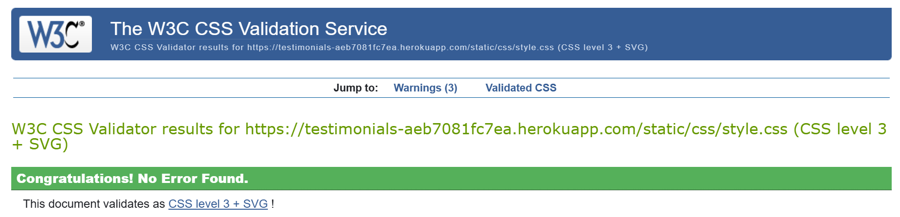

# Volunteer Testimonials - HopeBridge Community

**Volunteer Testimonials** is a full-stack web application built with Django. It allows users to share and read real-life stories about their experiences participating in social and volunteering projects. The name **HopeBridge Community** was not chosen at the beginning of the project.

The site is designed with accessibility and user experience in mind, following modern development practices using HTML, CSS, JavaScript, Python, and Django.  

**Project Journey**  
This project was a real challenge for me. For most of the post-third project period, I had to work longer hours at my job, which left me with very limited time to study. It was only towards the end that my workload at the company decreased, allowing me to dedicate more time to completing the project. There were many moments when I almost gave up. Thank you, and I apologize for any rough edges!

---

## 📑 Table of Contents

1. [Purpose](#purpose)
2. [Target Users](#target-users)
3. [Features](#features)
4. [User Stories](#user-stories)
5. [Wireframes](#wireframes)
6. [Technologies Used](#technologies-used)
7. [Data Schema](#data-schema)
8. [CRUD Functionality](#crud-functionality)
9. [Testing](#testing)
   - [Responsiveness](#responsiveness)
   - [W3C HTML Validator](#w3c-html-validator)
   - [W3C CSS Validator](#w3c-css-validator)
   - [Accessibility](#accessibility)
     - [Wave](#wave)  
     - [Lighthouse](#lighthouse)
10. [Deployment](#deployment)
11. [Credits](#credits)


---

## Purpose
[▲ Back to Top](#volunteer-testimonials---hopebridge-community)

The purpose of this application is to:

- Provide a platform for users to submit testimonials about volunteering experiences
- Allow visitors to read and get inspired by others’ stories
- Enable administrators to manage, approve, or remove testimonials


---

## Target Users  
[▲ Back to Top](#volunteer-testimonials---hopebridge-community)

The project was designed with the following user groups in mind:

### General Visitors:
- Browse published testimonials for inspiration  
- View full details of each story  
- Submit questions through a contact form  

### Registered Users:
- Create an account to share a testimonial  
- Manage (edit or delete) their own testimonial  
- Receive confirmation messages upon actions  

### Admin Users:
- Approve or reject **testimonials**    
- Remove testimonials that do not meet the platform’s guidelines  
- Receive contact form messages via email  


---

## Features  
[▲ Back to Top](#volunteer-testimonials---hopebridge-community)  

On the homepage, visitors are invited to join the community. They can view testimonials, and by clicking Read More, they can read the testimonial details. The Home, Login, Sign Up, and Contact links are clearly located, centered just below the HopeBridge Community header.  

Predominant colors:  

- #ffffff → pure white (RGB 255, 255, 255);  

- #f9f9f9 → a slightly grayish white (RGB 249, 249, 249);  

Colors to contrast:

- #0d1b4c → navy blue (RGB 13, 27, 76);


- #ffdd57 → yellow (RGB 255, 221, 87); 


- #555555 → dark grey (RGB 85, 85, 85);  


By clicking Read more, the visitor/user continues to view the links to navigate the site. They see the author of the testimonial, the title, the full comment, the image, the post date, and the return link.  

  

On the login page, you'll find username and password fields. A "Log In" button takes you to the home page after correct input. Below, you'll find links to change your password and sign up.  

  

On the Sign Up page, there are fields for creating an account: Username, Email, Password, information for creating a correct password, Password confirmation, a Register button, and a Log in link below (if the user is already registered).

  

The Contact page is open to everyone. Anyone can freely contact the HopeBridge Community. The fields to fill out are: Name, Email, and Message. Below is the Send Message button.  
Note: The back link on the right side at the bottom of the Login, Registration, Contact and Testimonial Details pages redirects the visitor/user to the home page.  

  

To reset your password, the Reset Password page has a field for entering your email address and below it, the "Send Reset Link" button. On the bottom right, there's a link to return to the login page.  

  

After the visitor/user sends the email to reset their password, a page opens with the message: Password Reset Sent. If an account exists with the email you entered, you will receive a password reset link shortly. Please check your email.  
Below on the right side is the link to the Login page.  

  

On the password change page, there are the following fields to fill in: _Old password; _New password; _New password confirmation.
Information is provided to correctly enter the password. Below, the user has the "Change Password" button.  


Features related to pages accessed by logged-in users, in relation to sending, editing and deleting testimonials, are demonstrated in [CRUD Functionality](#crud-functionality).  


---

## User Stories  
[▲ Back to Top](#volunteer-testimonials---hopebridge-community)

User stories were planned and tracked using the [GitHub Projects Board](<https://github.com/users/JulianaZani/projects/1/views/1?layout=board>).  

Below are the user stories defined for the project:  


### MoSCoW Prioritization

| Category         | User Stories                                                                 | Points | % of Total |
|-----------------|-------------------------------------------------------------------------------|--------|-----------|
| **Must Have**   | 1. View Testimonials <br> 2. Register an Account <br> 3. Login to My Account <br> 4. Submit a Testimonial | 4 | 44% |
| **Should Have** | 5. Edit My Testimonial <br> 6. Delete My Testimonial                         | 2 | 22% |
| **Could Have**  | 7. Admin Approval <br> 8. Contact Form <br> 9. Responsive Design              | 3 | 33% |
| **Total**       | **9**                                                                        | **9**  | **100%** |

**Rule:** *Should Have* ≤ 60% 


---

## Wireframes  
[▲ Back to Top](#volunteer-testimonials---hopebridge-community)

  


---

## Technologies Used  
[▲ Back to Top](#volunteer-testimonials---hopebridge-community)

Languages & Frameworks  
- Python 3.x – Main backend programming language

- Django 5.2.4 – Full-stack web framework

- HTML5, CSS3, and JavaScript – Structure, styling, and interactivity for the frontend

Database  
- SQLite – Database used in the development environment

- PostgreSQL – Database used in production (Heroku)

Storage & Media  
- Cloudinary – Image hosting and optimization

- dj3-cloudinary-storage – Integration between Django and Cloudinary

Servers & Deployment  
- Heroku – Hosting for the production environment

- Gunicorn – WSGI server for Django applications

- Whitenoise – Serving static files in production

Dependencies & Utilities  
- Pillow – Image manipulation for Django

- dj-database-url – Simplified database configuration with environment variables

- psycopg2-binary – PostgreSQL driver for Python/Django

- Requests – For making HTTP requests when needed

- asgiref, sqlparse, tzdata – Internal Django dependencies  


---

## Data Schema  
[▲ Back to Top](#volunteer-testimonials---hopebridge-community) 

**ER Diagram**  
```
+--------------------+        1       N  +----------------------+
|       User         |------------------>|     Testimonial      |
+--------------------+                   +----------------------+
| PK id              |                   | PK id                |
| username           |                   | FK user_id           |
| email              |                   | title                |
| password           |                   | content              |
| first_name         |                   | image                |
| last_name          |                   | created_on           |
| is_staff           |                   | approved             |
| is_superuser       |                   +----------------------+
| is_active          |
| date_joined        |
+--------------------+
```


---

## CRUD Functionality  
[▲ Back to Top](#volunteer-testimonials---hopebridge-community) 

The project implements full CRUD functionality for testimonials:  

Create – Users can submit a new testimonial in "Submit Testimonial".  


Read – All testimonials are displayed on the homepage for users to view.  


Update – Logged-in users can edit their testimonials via the "Edit" button.  


Delete – Logged-in users can delete a testimonial they created.  


---

## Testing
[▲ Back to Top](#volunteer-testimonials---hopebridge-community)

### Responsiveness

The HopeBridge community website is fully responsive and adapts to all screen sizes, from mobile devices to large desktops.  


**Examples**  

- Screen size - 768x1024:  

  

- Screen size - 324x726:  

  

- Screen size - 2000x1347  

  


### W3C HTML Validator  

Pages checked and approved:  

- Initial page: https://testimonials-aeb7081fc7ea.herokuapp.com/  

  

- Login page: https://testimonials-aeb7081fc7ea.herokuapp.com/accounts/login/  


- Signup page: https://testimonials-aeb7081fc7ea.herokuapp.com/accounts/signup/  

**Errors presented:**  


Adjustments made: delete "small" tag and add passwords helptext id in signup.html  
**After fixing the errors:**  


 
- Contact page: https://testimonials-aeb7081fc7ea.herokuapp.com/contact/  


- Submit testimonial page: https://testimonials-aeb7081fc7ea.herokuapp.com/testimonial/add/  


- Change password page: https://testimonials-aeb7081fc7ea.herokuapp.com/accounts/password_change/  


- Testimonial edit page: https://testimonials-aeb7081fc7ea.herokuapp.com/testimonial/13/edit/  


- Testimonial delete page: https://testimonials-aeb7081fc7ea.herokuapp.com/testimonial/13/delete/  


- Testimonial detail page: https://testimonials-aeb7081fc7ea.herokuapp.com/testimonial/13/  
and https://testimonials-aeb7081fc7ea.herokuapp.com/testimonial/14/ .  

**Errors presented:**  

  

  

Adjustment made: delete {{ testimonial.content|linebreaksbr }} "p" tags in testimonial_detail.html.  
**After fixing the errors:**  

  

  

- Password reset page: https://testimonials-aeb7081fc7ea.herokuapp.com/accounts/password_reset/  

  

- Done password reset message page: https://testimonials-aeb7081fc7ea.herokuapp.com/accounts/password_reset/done/  

  


### W3C CSS Validator  

No errors were found when passing through the official (Jigsaw) validator.  




### Accessibility 

I confirmed that the colors and fonts chosen are easy to read and accessible by running it through lighthouse in devtools and Wave Evolution Tool.  

#### Wave  

- Initial page: https://testimonials-aeb7081fc7ea.herokuapp.com/  

  

- Login page: https://testimonials-aeb7081fc7ea.herokuapp.com/accounts/login/  


- Signup page: https://testimonials-aeb7081fc7ea.herokuapp.com/accounts/signup/  


- Contact page: https://testimonials-aeb7081fc7ea.herokuapp.com/contact/  


- Submit testimonial page: https://testimonials-aeb7081fc7ea.herokuapp.com/testimonial/add/  


- Change password page: https://testimonials-aeb7081fc7ea.herokuapp.com/accounts/password_change/  

  

- Testimonial detail page: https://testimonials-aeb7081fc7ea.herokuapp.com/testimonial/13/


- Testimonial edit page: https://testimonials-aeb7081fc7ea.herokuapp.com/testimonial/13/edit/  


- Testimonial delete page: https://testimonials-aeb7081fc7ea.herokuapp.com/testimonial/13/delete/  

  

- Password reset page: https://testimonials-aeb7081fc7ea.herokuapp.com/accounts/password_reset/  

  

- Done password reset message page: https://testimonials-aeb7081fc7ea.herokuapp.com/accounts/password_reset/done/  

  


#### Lighthouse  

**Pages that had no problems:**  

- Login page: https://testimonials-aeb7081fc7ea.herokuapp.com/accounts/login/  


- Signup page: https://testimonials-aeb7081fc7ea.herokuapp.com/accounts/signup/  


- Contact page: https://testimonials-aeb7081fc7ea.herokuapp.com/contact/  


- Submit testimonial page: https://testimonials-aeb7081fc7ea.herokuapp.com/testimonial/add/  


- Change password page: https://testimonials-aeb7081fc7ea.herokuapp.com/accounts/password_change/  

  

- Testimonial edit page: https://testimonials-aeb7081fc7ea.herokuapp.com/testimonial/13/edit/  


- Testimonial delete page: https://testimonials-aeb7081fc7ea.herokuapp.com/testimonial/13/delete/  

  

- Password reset page: https://testimonials-aeb7081fc7ea.herokuapp.com/accounts/password_reset/  

  

- Done password reset message page: https://testimonials-aeb7081fc7ea.herokuapp.com/accounts/password_reset/done/  

  


**Pages that had problems:**

- Initial page: https://testimonials-aeb7081fc7ea.herokuapp.com/  

**BEFORE**  

  

Mixed Content Error.  
To fix the Mixed Content issue and force all Cloudinary images to be uploaded using HTTPS, I set secure=True in cloudinary.config and adjusted the MEDIA_URL (MEDIA_URL = f'https://res.cloudinary.com/{cloudinary.config().cloud_name}/image/upload/').  

Console showing errors:  

  

**AFTER**  

 

**Problems to solve:**  

  

  


- Testimonial detail page: https://testimonials-aeb7081fc7ea.herokuapp.com/testimonial/13/  

**BEFORE**  

  

ERRORS:  


To fix the error I created templatetags/ cloudinary_filters.py and updated the image tag in testimonial_detail.html (src="{{ testimonial.image.url|cloudinary_optimize }}"
alt="Photo for {{ testimonial.title }}"loading="lazy">).

**AFTER**

 


---

## Deployment
[▲ Back to Top](#volunteer-testimonials---hopebridge-community)  

- Steps for deployment:

  - Create a new Heroku app
  - Set the buildpack to Python 
  - Link the Heroku app to the Github repository
  - Click on Deploy

---

## Credits
[▲ Back to Top](#volunteer-testimonials---hopebridge-community)

All of Code Institute's classes (from the beginning to the present) have been the foundation of my learning (although I completely forgot about the Django AllAuth classes and did so much manually).
I conducted research using: chatGPT, YouTube, Google, and GitHub.
The content of the testimonials was created by me based on my experiences with some social activities I engaged in throughout my life while living in Brazil.
I found the images on Google Images (I chose the Creative Commons licensed search engine) to complement the testimonials:
images source: 
https://itoldya420.getarchive.net/amp/media/coast-guard-station-crew-visits-nursing-facility-for-valentines-day-dvids1094304-583d1b  
https://www.streetlab.org/2018/08/28/making-a-place-for-learning-at-nyc-play-streets/  
https://cura.org.au/  
https://picryl.com/media/help-child-charity-people-908b3c
https://aserghc.com.br/festa-das-criancas-reune-milhares-de-trabalhadores-e-suas-familias