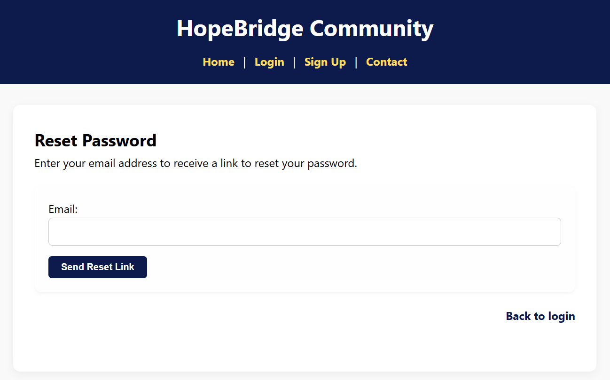
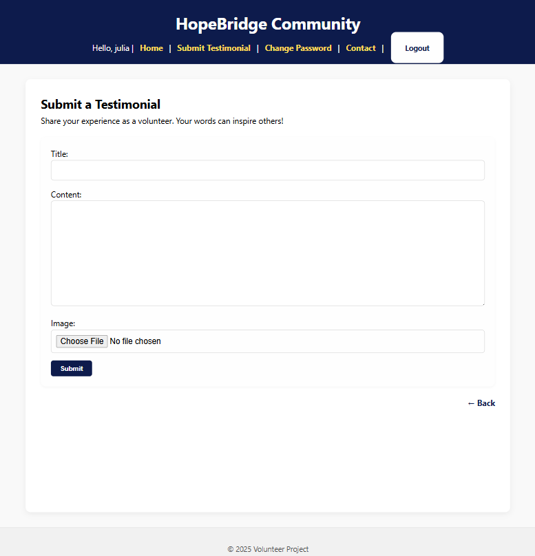
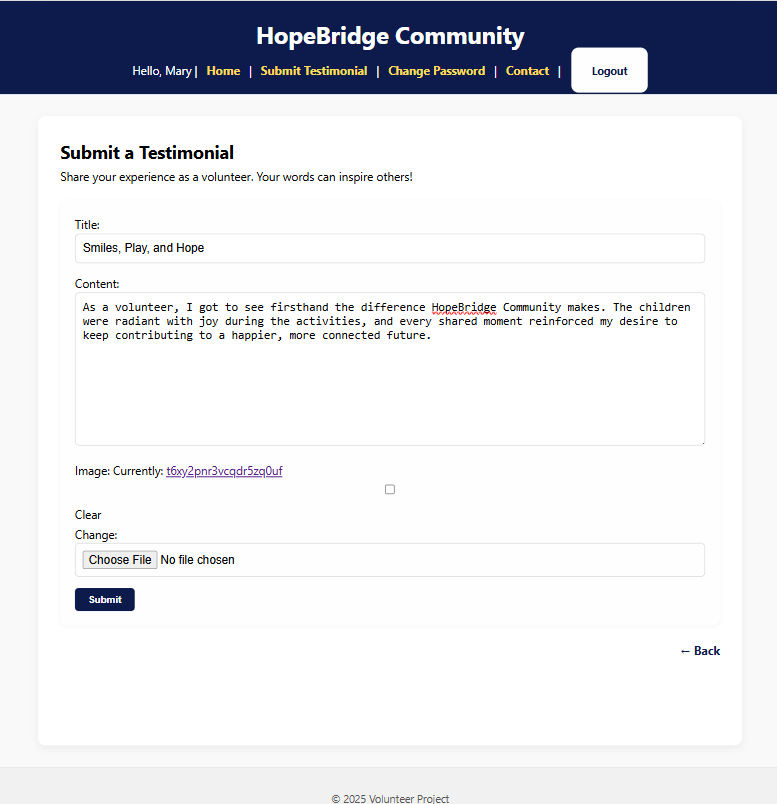
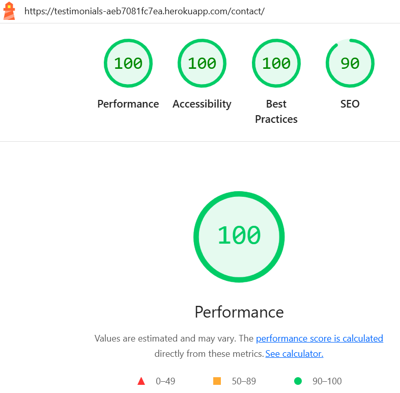
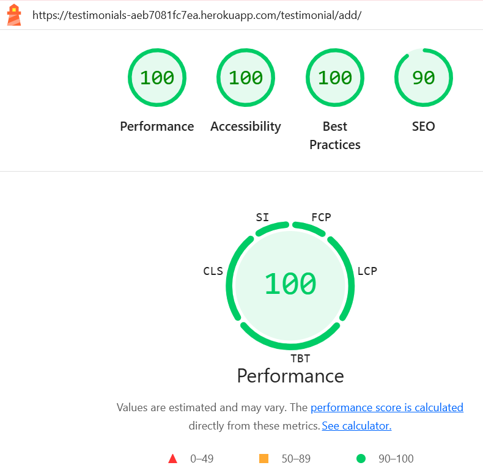

# Volunteer Testimonials - HopeBridge Community

**Volunteer Testimonials** is a full-stack web application built with Django. It allows users to share and read real-life stories about their experiences participating in social and volunteering projects. The name **HopeBridge Community** was not chosen at the beginning of the project.

The site is designed with accessibility and user experience in mind, following modern development practices using HTML, CSS, JavaScript, Python, and Django.    
The project is available online at:  
[https://testimonials-aeb7081fc7ea.herokuapp.com/](https://testimonials-aeb7081fc7ea.herokuapp.com/)  

**Project Journey**  
This project was a real challenge for me. For most of the post-third project period, I had to work longer hours at my job, which left me with very limited time to study. It was only towards the end that my workload at the company decreased, allowing me to dedicate more time to completing the project. There were many moments when I almost gave up. Thank you, and I apologize for any rough edges!


---

## 📑 Table of Contents

1. [Purpose](#purpose)
2. [Target Users](#target-users)
3. [Features](#features)
4. [User Stories](#user-stories)
5. [Wireframes](#wireframes)
6. [Technologies Used](#technologies-used)
7. [Data Schema](#data-schema)
8. [CRUD Functionality](#crud-functionality)
9. [Testing](#testing)
   - [Responsiveness](#responsiveness)
   - [W3C HTML Validator](#w3c-html-validator)
   - [W3C CSS Validator](#w3c-css-validator)
   - [JSHint](#jshint)
   - [PEP8](#pep8)
   - [Accessibility](#accessibility)
     - [Wave](#wave)  
     - [Lighthouse](#lighthouse)
10. [Deployment](#deployment)
11. [Security](#security)
12. [Bugs](#bugs)
13. [Credits](#credits)


---

## Purpose
[▲ Back to Top](#volunteer-testimonials---hopebridge-community)

The purpose of this application is to:

- Provide a platform for users to submit testimonials about volunteering experiences
- Allow visitors to read and get inspired by others’ stories
- Enable administrators to manage, approve, or remove testimonials


---

## Target Users  
[▲ Back to Top](#volunteer-testimonials---hopebridge-community)

The project was designed with the following user groups in mind:

### General Visitors:
- Browse published testimonials for inspiration  
- View full details of each story  
- Submit questions through a contact form  

### Registered Users:
- Create an account to share a testimonial  
- Manage (edit or delete) their own testimonial  
- Receive confirmation messages upon actions  

### Admin Users:
- Approve or reject **testimonials**    
- Remove testimonials that do not meet the platform’s guidelines  
- Receive contact form messages via email  


---

## Features  
[▲ Back to Top](#volunteer-testimonials---hopebridge-community)  

On the homepage, visitors are invited to join the community. They can view testimonials, and by clicking Read More, they can read the testimonial details. The Home, Login, Sign Up, and Contact links are clearly located, centered just below the HopeBridge Community header.  

Predominant colors:  

- #ffffff → pure white (RGB 255, 255, 255);  

- #f9f9f9 → a slightly grayish white (RGB 249, 249, 249);  

Colors to contrast:

- #0d1b4c → navy blue (RGB 13, 27, 76);


- #ffdd57 → yellow (RGB 255, 221, 87); 


- #555555 → dark grey (RGB 85, 85, 85);  


By clicking Read more, the visitor/user continues to view the links to navigate the site. They see the author of the testimonial, the title, the full comment, the image, the post date, and the return link.  

  

On the login page, you'll find username and password fields. A "Log In" button takes you to the home page after correct input. Below, you'll find links to change your password and sign up.  

  

On the Sign Up page, there are fields for creating an account: Username, Email, Password, information for creating a correct password, Password confirmation, a Register button, and a Log in link below (if the user is already registered).

  

The Contact page is open to everyone. Anyone can freely contact the HopeBridge Community. The fields to fill out are: Name, Email, and Message. Below is the Send Message button.  
Note: The back link on the right side at the bottom of the Login, Registration, Contact and Testimonial Details pages redirects the visitor/user to the home page.  

  

To reset your password, the Reset Password page has a field for entering your email address and below it, the "Send Reset Link" button. On the bottom right, there's a link to return to the login page.  

  

After the visitor/user sends the email to reset their password, a page opens with the message: Password Reset Sent. If an account exists with the email you entered, you will receive a password reset link shortly. Please check your email.  
Below on the right side is the link to the Login page.  

  

On the password change page, there are the following fields to fill in: _Old password; _New password; _New password confirmation.
Information is provided to correctly enter the password. Below, the user has the "Change Password" button.  


Features related to pages accessed by logged-in users, in relation to sending, editing and deleting testimonials, are demonstrated in [CRUD Functionality](#crud-functionality).  


---

## User Stories  
[▲ Back to Top](#volunteer-testimonials---hopebridge-community)

User stories were planned and tracked using the [GitHub Projects Board](<https://github.com/users/JulianaZani/projects/1/views/1?layout=board>).  

All user stories have been successfully implemented.

Below are the user stories defined for the project:  

  

View Testimonials #1  
As a visitor, I want to view testimonials, so I can feel inspired to get involved.   
Acceptance Criteria:  
I can see a list of published testimonials on the homepage or a testimonial page.  
Each testimonial shows the name, short message, and optionally a photo.  
I can read the full testimonial if I click on it.  

Register an Account #2  
As a visitor, I want to register an account, so I can submit my testimonial.  
Acceptance Criteria:  
I can sign up with a username, password, and optional email.  
After registering, I’m redirected or logged in automatically.  
I see a confirmation message when my account is created.  

Login to My Account #3    
As a registered user, I want to log in, so I can submit and manage my testimonials.  
Acceptance Criteria:  
I can log in using my username and password.  
I’m redirected to the homepage or dashboard after login.  
A message confirms that I am logged in.  

Comment: After login, I can see my username on the homepage, confirming I am logged in.  

Submit a Testimonial #4  
As a logged-in user, I want to submit a testimonial, so I can share my experience with others.  
Acceptance Criteria:  
I see a form to submit my name, testimonial message, and optional image.  
The form validates required fields and shows feedback if something is missing.  
I get a message confirming that the testimonial was submitted.  
The testimonial goes to "pending" status (not live immediately).  

Edit My Testimonial #5  
As a logged-in user, I want to edit my own testimonial, so I can fix errors or update it.  
Acceptance Criteria:  
I can see a list of my submitted testimonials.  
I can edit any testimonial I created.  
I get confirmation after saving changes.  

Delete My Testimonial #6  
As a logged-in user, I want to delete my testimonial, so I can remove it if I no longer want it public.  
Acceptance Criteria:  
I can delete my own testimonial from a list or detail view.  
I get a confirmation prompt before deletion.  
A success message confirms removal.  

Admin Approval #7    
As a site admin, I want to approve or reject both new and edited testimonials, so I can ensure content quality is maintained.  
Acceptance Criteria:  
When a testimonial is submitted or edited, it is marked as pending.  
I can view all pending testimonials (new or edited) in the admin panel.  
I can choose to approve or reject each one.  
Only approved testimonials are visible on the site.  
Rejected testimonials remain hidden from public view.  

Contact Form #8    
As a visitor, I want to contact the organization, so I can ask questions or offer to help.  
Acceptance Criteria:  
A contact form is available with name, email, and message fields.  
I receive a confirmation after sending a message.  
The message is emailed to the admin.    

Responsive Design #9    
As a user, I want the site to be responsive, so I can access it from any device.  
Acceptance Criteria:  
The layout adapts to mobile, tablet, and desktop screens.  
All buttons, forms, and content remain functional and readable.  
Navigation is usable on all screen sizes.  

### MoSCoW Prioritization

| Category         | User Stories                                                                 | Points | % of Total |
|-----------------|-------------------------------------------------------------------------------|--------|-----------|
| **Must Have**   | 1. View Testimonials <br> 2. Register an Account <br> 3. Login to My Account <br> 4. Submit a Testimonial | 4 | 44% |
| **Should Have** | 5. Edit My Testimonial <br> 6. Delete My Testimonial                         | 2 | 22% |
| **Could Have**  | 7. Admin Approval <br> 8. Contact Form <br> 9. Responsive Design              | 3 | 33% |
| **Total**       | **9**                                                                        | **9**  | **100%** |

**Rule:** *Should Have* ≤ 60% 


---

## Wireframes  
[▲ Back to Top](#volunteer-testimonials---hopebridge-community)

  


---

## Technologies Used  
[▲ Back to Top](#volunteer-testimonials---hopebridge-community)

Languages & Frameworks  
- Python 3.x – Main backend programming language

- Django 5.2.4 – Full-stack web framework

- HTML5, CSS3, and JavaScript – Structure, styling, and interactivity for the frontend

Database  
- SQLite – Database used in the development environment

- PostgreSQL – Database used in production (Heroku)

Storage & Media  
- Cloudinary – Image hosting and optimization

- dj3-cloudinary-storage – Integration between Django and Cloudinary

Servers & Deployment  
- Heroku – Hosting for the production environment

- Gunicorn – WSGI server for Django applications

- Whitenoise – Serving static files in production

Dependencies & Utilities  
- Pillow – Image manipulation for Django

- dj-database-url – Simplified database configuration with environment variables

- psycopg2-binary – PostgreSQL driver for Python/Django

- Requests – For making HTTP requests when needed

- asgiref, sqlparse, tzdata – Internal Django dependencies  


---

## Data Schema  
[▲ Back to Top](#volunteer-testimonials---hopebridge-community) 

**ER Diagram**  
```
+--------------------+        1       N  +----------------------+
|       User         |------------------>|     Testimonial      |
+--------------------+                   +----------------------+
| PK id              |                   | PK id                |
| username           |                   | FK user_id           |
| email              |                   | title                |
| password           |                   | content              |
| first_name         |                   | image                |
| last_name          |                   | created_on           |
| is_staff           |                   | approved             |
| is_superuser       |                   +----------------------+
| is_active          |
| date_joined        |
+--------------------+
```


---

## CRUD Functionality  
[▲ Back to Top](#volunteer-testimonials---hopebridge-community) 

The project implements full CRUD functionality for testimonials:  

**Create** – Users can submit a new testimonial in "Submit Testimonial".  

  

After the user submits a testimonial, the following message appears:  

  


**Read** – All testimonials are displayed on the homepage for users to view.  

 

The user can then access their own testimony, and the edit and delete buttons appear.  

**Update** – Logged-in users can edit their testimonials via the "Edit" button.  

After editing the statement, just click submit.  

  

After submitting the statement, a message will appear informing you that the edited statement will have to wait for the administrator's approval.  

  


**Delete** – Logged-in users can delete a testimonial they created.  

Instead of clicking edit, the user clicks delete and a page opens asking if the user really wants to delete.

  

After delete confirmation a delete confirmation message appears.  


---

## Testing
[▲ Back to Top](#volunteer-testimonials---hopebridge-community)

- I tested this website's functionality in multiple browsers: Chrome, Safari, Microsoft Edge, and Firefox.
- I confirmed that this project is responsive, looks good, and works on all standard screen sizes using the Device DevTools toolbar.
- I confirmed that the colors and fonts I chose are easy to read and accessible by running it in Wave and Lighthouse DevTools.
- The project is available online at https://testimonials-aeb7081fc7ea.herokuapp.com/

### Responsiveness

The HopeBridge community website is fully responsive and adapts to all screen sizes, from mobile devices to large desktops.  


**Examples**  

- Screen size - 768x1024:  

  

- Screen size - 324x726:  

  

- Screen size - 2000x1347  

  


### W3C HTML Validator  

Pages checked and approved:  

- Initial page: https://testimonials-aeb7081fc7ea.herokuapp.com/  

  

- Login page: https://testimonials-aeb7081fc7ea.herokuapp.com/accounts/login/  


- Signup page: https://testimonials-aeb7081fc7ea.herokuapp.com/accounts/signup/  

**Errors presented:**  


Adjustments made: delete "small" tag and add passwords helptext id in signup.html  
**After fixing the errors:**  


 
- Contact page: https://testimonials-aeb7081fc7ea.herokuapp.com/contact/  


- Submit testimonial page: https://testimonials-aeb7081fc7ea.herokuapp.com/testimonial/add/  


- Change password page: https://testimonials-aeb7081fc7ea.herokuapp.com/accounts/password_change/  


- Testimonial edit page: https://testimonials-aeb7081fc7ea.herokuapp.com/testimonial/13/edit/  


- Testimonial delete page: https://testimonials-aeb7081fc7ea.herokuapp.com/testimonial/13/delete/  


- Testimonial detail page: https://testimonials-aeb7081fc7ea.herokuapp.com/testimonial/13/  
and https://testimonials-aeb7081fc7ea.herokuapp.com/testimonial/14/ .  

**Errors presented:**  

  

  

Adjustment made: delete {{ testimonial.content|linebreaksbr }} "p" tags in testimonial_detail.html.  
**After fixing the errors:**  

  

  

- Password reset page: https://testimonials-aeb7081fc7ea.herokuapp.com/accounts/password_reset/  

  

- Done password reset message page: https://testimonials-aeb7081fc7ea.herokuapp.com/accounts/password_reset/done/  

  


### W3C CSS Validator  

No errors were found when passing through the official (Jigsaw) validator.  


### JSHint  

Script.js:  

  


### PEP8  

No errors were returned from PEP8 validator.  

**accounts/apps.py**  

  

**accounts/forms.py**

  

**accounts/tests.py**  

  

**accounts/urls.py**  

  

**accounts/views.py**  

  

**testimonials/templatetags/cloudinary_filters.py**  

  

**testimonials/admin.py**  

  

**testimonials/apps.py**  

  

**testimonials/forms.py**  

  

**testimonials/models.py**  

  

**testimonials/tests.py**  

  

**testimonials/urls.py**  

  

**testimonials/views.py**  

  

**volunteer_testimonials/asgi.py**  

  

**volunteer_testimonials/settings.py**  

  

**volunteer_testimonials/urls.py**  

  

**volunteer_testimonials/wsgi.py**  

  

**manage.py**  

 

### Accessibility 

I confirmed that the colors and fonts chosen are easy to read and accessible by running it through lighthouse in devtools and Wave Evolution Tool.  

#### Wave  

- Initial page: https://testimonials-aeb7081fc7ea.herokuapp.com/  

  

- Login page: https://testimonials-aeb7081fc7ea.herokuapp.com/accounts/login/  


- Signup page: https://testimonials-aeb7081fc7ea.herokuapp.com/accounts/signup/  


- Contact page: https://testimonials-aeb7081fc7ea.herokuapp.com/contact/  


- Submit testimonial page: https://testimonials-aeb7081fc7ea.herokuapp.com/testimonial/add/  


- Change password page: https://testimonials-aeb7081fc7ea.herokuapp.com/accounts/password_change/  

  

- Testimonial detail page: https://testimonials-aeb7081fc7ea.herokuapp.com/testimonial/13/


- Testimonial edit page: https://testimonials-aeb7081fc7ea.herokuapp.com/testimonial/13/edit/  


- Testimonial delete page: https://testimonials-aeb7081fc7ea.herokuapp.com/testimonial/13/delete/  

  

- Password reset page: https://testimonials-aeb7081fc7ea.herokuapp.com/accounts/password_reset/  

  

- Done password reset message page: https://testimonials-aeb7081fc7ea.herokuapp.com/accounts/password_reset/done/  

  


#### Lighthouse  

**Pages that had no problems:**  

- Login page: https://testimonials-aeb7081fc7ea.herokuapp.com/accounts/login/  


- Signup page: https://testimonials-aeb7081fc7ea.herokuapp.com/accounts/signup/  


- Contact page: https://testimonials-aeb7081fc7ea.herokuapp.com/contact/  



- Submit testimonial page: https://testimonials-aeb7081fc7ea.herokuapp.com/testimonial/add/  



- Change password page: https://testimonials-aeb7081fc7ea.herokuapp.com/accounts/password_change/  

  

- Testimonial edit page: https://testimonials-aeb7081fc7ea.herokuapp.com/testimonial/13/edit/  


- Testimonial delete page: https://testimonials-aeb7081fc7ea.herokuapp.com/testimonial/13/delete/  

  

- Password reset page: https://testimonials-aeb7081fc7ea.herokuapp.com/accounts/password_reset/  

  

- Done password reset message page: https://testimonials-aeb7081fc7ea.herokuapp.com/accounts/password_reset/done/  

  


**Pages that had problems:**

- Initial page: https://testimonials-aeb7081fc7ea.herokuapp.com/  

**BEFORE**  

  

Mixed Content Error.  
To fix the Mixed Content issue and force all Cloudinary images to be uploaded using HTTPS, I set secure=True in cloudinary.config and adjusted the MEDIA_URL (MEDIA_URL = f'https://res.cloudinary.com/{cloudinary.config().cloud_name}/image/upload/').  

Console showing errors:  

  

**AFTER**  

 

**Problems to solve:**  

  

  


- Testimonial detail page: https://testimonials-aeb7081fc7ea.herokuapp.com/testimonial/13/  

**BEFORE**  

  

ERRORS:  


To fix the error I created templatetags/ cloudinary_filters.py and updated the image tag in testimonial_detail.html (src="{{ testimonial.image.url|cloudinary_optimize }}"
alt="Photo for {{ testimonial.title }}"loading="lazy">).

**AFTER**

 


---

## Deployment
[▲ Back to Top](#volunteer-testimonials---hopebridge-community)  

- Steps for deployment:

  - Generate requirements.txt: Pip freeze > requirements.txt  
  - Create Procfile: web: gunicorn volunteer_testimonials.wsgi  
  - Configure Environment Variables: settings.py  
  import os  
  SECRET_KEY = os.environ.get("SECRET_KEY", "default-key")  
  DEBUG = os.environ.get("DEBUG", "False") == "True"  
  Heroku Dashboard → Settings → Config Vars:   
  SECRET_KEY=secret_key  
  DEBUG=False  
  - Create a new Heroku app: heroku create testimonials  
  - Set the buildpack to Python: heroku buildpacks:set heroku/python  
  - Link the Heroku app to the Github repository (https://github.com/JulianaZani/codeinstituteproject4)  
  - Click on Deploy  


---

## Security
[▲ Back to Top](#volunteer-testimonials---hopebridge-community)

This project follows good security practices to protect passwords, tokens, and secret keys:  

- Environment Variables (.env)  

Sensitive information, such as:  
Django's SECRET_KEY  
DATABASE_URL  
CLOUDINARY_URL  

These are stored in an .env file, which is not committed to Git.

- .gitignore  

The .env file is listed in .gitignore, ensuring that it is not committed to the public repository.  

- Secure Variable Loading  

During local development, variables are loaded via env.py.  

In production (Heroku), these variables are defined in the platform's environment variables panel.


---

## Bugs
[▲ Back to Top](#volunteer-testimonials---hopebridge-community)

In addition to the issues resolved and presented in the README development, I also encountered these:  
- Error 500 (Internal Server Error). I added the TestimonialForm to forms.py and it finally worked.
- When trying to log in: Page not found (404). I hadn't set LOGIN_REDIRECT_URL in the settings.
- When logging in, writing the testimonial, choosing the image, and clicking submit, I got this error: ValueError: Must supply api_key. I adjusted the cloudinary.config in settings.py and CLOUDINARY_URL in Heroku, and the site was able to accept testimonials with images.
- Error: Syntax problem in the template (testimonial_detail.html). I fixed the syntax by removing the parentheses that were there incorrectly, and it worked again.


---

## Credits
[▲ Back to Top](#volunteer-testimonials---hopebridge-community)

- All of Code Institute's classes (from the beginning to the present) have been the foundation of my learning (although I completely forgot about the Django AllAuth classes and did so much manually).
- I conducted research using: chatGPT, YouTube, Google, GitHub and Copilot.
- The content of the testimonials was created by me based on my experiences with some social activities I engaged in throughout my life while living in Brazil.
- I found the images on Google Images (I chose the Creative Commons licensed search engine) to complement the testimonials:  
https://itoldya420.getarchive.net/amp/media/coast-guard-station-crew-visits-nursing-facility-for-valentines-day-dvids1094304-583d1b  
https://www.streetlab.org/2018/08/28/making-a-place-for-learning-at-nyc-play-streets/  
https://cura.org.au/  
https://picryl.com/media/help-child-charity-people-908b3c
https://aserghc.com.br/festa-das-criancas-reune-milhares-de-trabalhadores-e-suas-familias